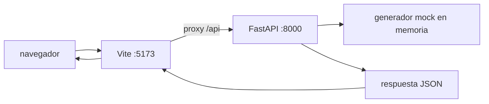

# Revisión heredada del proyecto

## Leyenda de verificación

- ✅ Verificada directamente en el código o en la configuración del repositorio.
- ❌ Incorrecta o contradicha por el código revisado.
- ❓ No verificable únicamente con los archivos disponibles, o depende de una condición de ejecución no observada.

## Alcance y fuente

✅ Este documento describe el estado actual del repositorio `ai-eng-financial-dashboard-context-project` a partir del código disponible en:

- [docker-compose.yml](docker-compose.yml)
- [README.md](README.md)
- [README.es.md](README.es.md)
- [backend/app/main.py](backend/app/main.py)
- [backend/app/routes.py](backend/app/routes.py)
- [backend/requirements.txt](backend/requirements.txt)
- [backend/Dockerfile](backend/Dockerfile)
- [backend/tests/test_routes.py](backend/tests/test_routes.py)
- [frontend/package.json](frontend/package.json)
- [frontend/vite.config.ts](frontend/vite.config.ts)
- [frontend/Dockerfile](frontend/Dockerfile)
- [frontend/src/App.tsx](frontend/src/App.tsx)
- [frontend/src/lib/financial-types.ts](frontend/src/lib/financial-types.ts)
- [frontend/src/lib/financial-utils.ts](frontend/src/lib/financial-utils.ts)
- [frontend/src/lib/financial-utils.test.ts](frontend/src/lib/financial-utils.test.ts)
- Los componentes bajo [frontend/src/components/dashboard](frontend/src/components/dashboard)

✅ No se encontró `./.agents/rules`, `./.agents/skills` ni `./memory-bank` en el workspace al momento de esta revisión. ✅ No hay base de datos, migraciones, autenticación, persistencia ni servicio externo configurado en el código revisado.

## Resumen ejecutivo

✅ Es un dashboard financiero de demostración compuesto por:

1. ✅ Un backend FastAPI que genera 360 movimientos financieros sintéticos en memoria.
2. ✅ Un frontend React + TypeScript que solicita todos esos movimientos mediante `GET /api/metrics`.
3. ✅ Utilidades del frontend que calculan los KPI y agregan los movimientos por mes.
4. ✅ Dos gráficos Recharts: ingresos frente a gastos y margen de beneficio.
5. ✅ Docker Compose para ejecutar frontend y backend juntos con hot reload.

✅ El backend contiene más capacidades que las usadas actualmente por la interfaz: facets, resumen, categorías principales, comparación, alertas y endpoints B2B/B2C. ✅ El flujo actual del navegador solo consume `/api/metrics` sin filtros.

## Stack tecnológico

### Backend

- ✅ Python 3.13 sobre `python:3.13-slim`, definido en [backend/Dockerfile](backend/Dockerfile#L1).
- ✅ FastAPI para HTTP y validación de respuestas, en [backend/app/main.py](backend/app/main.py#L1-L8) y [backend/app/routes.py](backend/app/routes.py#L205-L363).
- ✅ Uvicorn como servidor ASGI, definido en [backend/Dockerfile](backend/Dockerfile#L10-L14).
- ✅ Pydantic, usado mediante `BaseModel` y los modelos de respuesta en [backend/app/routes.py](backend/app/routes.py#L16-L53).
- ✅ `debugpy` para depuración remota en el puerto 5678, definido en [backend/Dockerfile](backend/Dockerfile#L10-L14).
- ✅ Pytest, pytest-cov y httpx para pruebas, declarados en [backend/requirements.txt](backend/requirements.txt#L1-L6) y usados en [backend/tests/test_routes.py](backend/tests/test_routes.py#L1-L10).

### Frontend

- ✅ React 19.2 y `react-dom`, declarados en [frontend/package.json](frontend/package.json#L15-L16).
- ✅ TypeScript 6, declarado en [frontend/package.json](frontend/package.json#L25-L25).
- ✅ Vite 8 como servidor de desarrollo y bundler, declarado en [frontend/package.json](frontend/package.json#L27-L27) y configurado en [frontend/vite.config.ts](frontend/vite.config.ts#L1-L16).
- ✅ Tailwind CSS 4 mediante `@tailwindcss/vite`, declarado en [frontend/package.json](frontend/package.json#L18-L18) y configurado en [frontend/vite.config.ts](frontend/vite.config.ts#L1-L8).
- ✅ Recharts 3.8 para gráficos, declarado en [frontend/package.json](frontend/package.json#L21-L21) y usado en [frontend/src/components/dashboard/income-outcome-chart.tsx](frontend/src/components/dashboard/income-outcome-chart.tsx#L1-L12).
- ✅ Lucide React para iconos, declarado en [frontend/package.json](frontend/package.json#L20-L20) y usado en [frontend/src/components/dashboard/dashboard-header.tsx](frontend/src/components/dashboard/dashboard-header.tsx#L1-L10).
- ✅ Vitest 4 para pruebas, declarado en [frontend/package.json](frontend/package.json#L28-L28) y usado en [frontend/src/lib/financial-utils.test.ts](frontend/src/lib/financial-utils.test.ts#L1-L8).
- ✅ ESLint 9 con reglas de TypeScript, React Hooks y React Refresh, declarado en [frontend/package.json](frontend/package.json#L26-L26) y configurado en [frontend/eslint.config.js](frontend/eslint.config.js#L1-L20).
- ✅ Node 24 sobre `node:24-alpine`, definido en [frontend/Dockerfile](frontend/Dockerfile#L1).

### Infraestructura local

- ✅ Docker Compose con dos servicios en [docker-compose.yml](docker-compose.yml#L1-L27).
- ✅ La configuración usa el hostname `backend` como destino del proxy de Vite, en [frontend/vite.config.ts](frontend/vite.config.ts#L9-L15).
- ✅ Volúmenes montados:
  - ✅ `./frontend:/app`, definido en [docker-compose.yml](docker-compose.yml#L15-L18).
  - ✅ `./backend:/app`, definido en [docker-compose.yml](docker-compose.yml#L5-L8).
  - ✅ Volumen anónimo `/app/node_modules` para no sobrescribir dependencias del contenedor frontend, definido en [docker-compose.yml](docker-compose.yml#L15-L18).

## Arquitectura y flujo de ejecución



✅ El diagrama representa el flujo configurado en Vite, FastAPI y los endpoints actuales.

### Arranque

1. ✅ `docker compose up --build` construye ambos servicios, instala sus dependencias y ejecuta los comandos definidos en cada Dockerfile. Es el comando documentado en [README.es.md](README.es.md#L29-L40).
2. ✅ El backend inicia `debugpy`, que escucha en `0.0.0.0:5678`, y luego Uvicorn con `app.main:app` en `0.0.0.0:8000` y `--reload`, según [backend/Dockerfile](backend/Dockerfile#L10-L14).
3. ✅ El frontend inicia Vite en `0.0.0.0:5173`, según [frontend/Dockerfile](frontend/Dockerfile#L10-L12).
4. ✅ Vite reenvía las rutas que empiezan por `/api` a `http://backend:8000`, según [frontend/vite.config.ts](frontend/vite.config.ts#L9-L15).
5. ✅ El navegador carga `App`, que ejecuta un `fetch` a `/api/metrics` en el efecto de montaje, según [frontend/src/App.tsx](frontend/src/App.tsx#L20-L42).

### Scripts declarados

✅ Los scripts reales de [frontend/package.json](frontend/package.json#L6-L13) son:

- ✅ `npm run dev`: inicia Vite.
- ✅ `npm run build`: ejecuta `tsc -b` y después `vite build`.
- ✅ `npm run lint`: ejecuta ESLint.
- ✅ `npm run preview`: inicia la previsualización del build.
- ✅ `npm run test`: ejecuta Vitest una vez.
- ✅ `npm run test:watch`: ejecuta Vitest en modo observación.
- ✅ `npm run test:coverage`: ejecuta Vitest con cobertura.

✅ No hay scripts declarados en `requirements.txt` y no se observó un `pyproject.toml` en el workspace revisado; la ejecución directa está codificada en el `CMD` del Dockerfile. ❓ La frase "desde el directorio apropiado" describe una condición de ejecución, no una configuración explícita del repositorio.

## Contrato de datos del backend

### Entidad principal: `FinancialMovement`

✅ Definida en [backend/app/routes.py](backend/app/routes.py#L16-L22):

```json
{
  "create_date": "2026-01-10",
  "amount": 2500.75,
  "operation_type": "income",
  "category": "sales",
  "business_type": "B2B"
}
```

Campos:

- ✅ `create_date`: fecha ISO, tipo `date`.
- ✅ `amount`: número decimal representado como `float`.
- ✅ `operation_type`: solamente `income` u `outcome`.
- ✅ `category`: solamente `suppliers`, `sales`, `operational`, `administrative` u `others`.
- ✅ `business_type`: solamente `B2B` o `B2C`.

✅ La generación se realiza en `_build_movement` y `generate_mock_movements` en [backend/app/routes.py](backend/app/routes.py#L58-L95):

- ✅ Siempre genera 12 meses × 30 registros = 360 movimientos.
- ✅ Para cada mes usa una probabilidad aleatoria de ingreso entre `0.45` y `0.7`.
- ✅ Los ingresos tienen categoría `sales` el 90% de las veces y `others` el resto.
- ✅ Los ingresos están entre 800 y 12000.
- ✅ Los gastos usan una de cuatro categorías y están entre 500 y 9000.
- ✅ El tipo B2B se asigna con probabilidad 0.55; el resto es B2C.
- ✅ Los días se restringen del 1 al 28 para evitar fechas inválidas.
- ✅ Los endpoints pasan `seed=42`, por lo que los valores aleatorios se repiten para un mismo día del sistema.

## Endpoints del backend

✅ Todos están definidos en [backend/app/routes.py](backend/app/routes.py#L205-L363). ✅ FastAPI valida los parámetros `Literal`; ❓ el comportamiento HTTP exacto de `422` no está cubierto por los tests leídos, aunque es el comportamiento esperado de FastAPI para una validación fallida.

### `GET /health`

✅ Recibe: ningún parámetro.

✅ Devuelve:

```json
{"status": "ok"}
```

### `GET /api/metrics`

✅ Recibe parámetros opcionales:

- ✅ `start_date`: fecha inclusiva.
- ✅ `end_date`: fecha inclusiva.
- ✅ `category`: categoría.
- ✅ `operation_type`: `income` u `outcome`.

✅ Devuelve una lista de hasta 360 objetos `FinancialMovement`, ordenada por `create_date`.

### `GET /api/metrics/facets`

✅ Recibe: ningún parámetro.

✅ Devuelve un objeto `MetricsFacets` con:

- ✅ `operation_types`: tipos presentes.
- ✅ `business_types`: tipos de negocio presentes.
- ✅ `categories`: categorías presentes.
- ✅ `min_date` y `max_date`: fechas extremas.

### `GET /api/metrics/summary`

✅ Recibe:

- ✅ `group_by`: `day`, `week` o `month`; por defecto `month`.
- ✅ `start_date`, `end_date`.
- ✅ `category`, `operation_type`.
- ✅ `business_type`: `B2B` o `B2C`.

✅ Devuelve una lista `MetricsSummaryItem`:

```json
{
  "period": "2026-03",
  "income": 25000.0,
  "outcome": 14000.0,
  "net": 11000.0
}
```

✅ La agrupación usa fecha ISO para día, `YYYY-Www` para semana ISO y `YYYY-MM` para mes.

### `GET /api/metrics/categories/top`

✅ Recibe:

- ✅ `operation_type`: por defecto `outcome`.
- ✅ `limit`: entre 1 y 20; por defecto 5.
- ✅ `start_date`, `end_date`.
- ✅ `business_type`.

✅ Devuelve categorías ordenadas de mayor a menor importe, con `category`, `operation_type` y `total_amount`.

### `GET /api/metrics/comparison`

✅ Recibe obligatoriamente:

- ✅ `start_date`.
- ✅ `end_date`.

✅ También acepta `business_type`.

✅ Devuelve:

```json
{
  "current_period": 11000.0,
  "previous_period": 9000.0,
  "delta_abs": 2000.0,
  "delta_pct": 22.22
}
```

✅ El período anterior tiene la misma duración y termina el día anterior a `start_date`. ✅ El porcentaje usa el valor absoluto del período anterior como denominador. ✅ Si el período anterior es cero, `delta_pct` es `null`.

### `GET /api/metrics/alerts`

✅ Recibe:

- ✅ `threshold`: mínimo de aumento relativo; por defecto `0.3`, con mínimo 0.
- ✅ `group_by`: `day`, `week` o `month`.
- ✅ `start_date`, `end_date`.
- ✅ `business_type`.

✅ Devuelve períodos en los que el `outcome` supera el promedio acumulado de períodos anteriores por encima del threshold:

```json
{
  "period": "2026-05",
  "outcome_total": 24000.0,
  "baseline_average": 15000.0,
  "increase_ratio": 0.6
}
```

✅ El primer período nunca genera alerta porque no tiene histórico previo. ✅ Un baseline igual a cero tampoco genera alerta.

### `GET /api/metrics/b2b` y `GET /api/metrics/b2c`

✅ Reciben los mismos filtros de fecha, categoría y tipo de operación que `/api/metrics`.

✅ Devuelven una lista de `FinancialMovement` ya filtrada por `business_type`.

## Flujo del frontend

### Entrada

✅ [frontend/src/App.tsx](frontend/src/App.tsx#L20-L26) construye la URL con `VITE_API_BASE_URL` o una cadena vacía y solicita:

```text
GET {VITE_API_BASE_URL}/api/metrics
```

✅ La respuesta se usa como `FinancialMovement[]`. ✅ No existe validación runtime del JSON recibido; TypeScript solo tipa el resultado después de `response.json()`.

### Transformaciones

✅ `computeKPIs` en [frontend/src/lib/financial-utils.ts](frontend/src/lib/financial-utils.ts#L20-L38):

- ✅ suma todos los importes `income` en `totalIncome`;
- ✅ suma todos los importes `outcome` en `totalOutcome`;
- ✅ calcula `profit = totalIncome - totalOutcome`;
- ✅ calcula `profitPercent = profit / totalIncome * 100` si hay ingresos; si no, devuelve 0.

✅ Devuelve `KPIMetrics`:

```json
{
  "totalIncome": 100000,
  "totalOutcome": 60000,
  "profit": 40000,
  "profitPercent": 40
}
```

✅ `computeMonthlyData` en [frontend/src/lib/financial-utils.ts](frontend/src/lib/financial-utils.ts#L40-L72):

- ✅ convierte cada `create_date` a `Date`;
- ✅ agrupa por año y mes;
- ✅ acumula ingresos y gastos;
- ✅ calcula el margen mensual;
- ✅ ordena las claves cronológicamente;
- ✅ devuelve `MonthlyDataPoint[]` con etiquetas como `Jan 2026`.

### Presentación

✅ [frontend/src/App.tsx](frontend/src/App.tsx#L44-L70) renderiza:

- ✅ `DashboardHeader`: título y período textual.
- ✅ `KPIRow`: cuatro tarjetas: ingresos, gastos, beneficio y margen.
- ✅ `IncomeOutcomeChart`: dos líneas mensuales, `income` y `outcome`.
- ✅ `ProfitPercentChart`: línea mensual de margen porcentual.

✅ Mientras se espera la respuesta se muestran skeletons. ✅ Si el `fetch` falla o devuelve un status no exitoso, se muestra un mensaje genérico y se mantienen las tarjetas/gráficos en estado de carga finalizado.

✅ El modo oscuro se fuerza agregando la clase `dark` al elemento principal. ✅ Las variables de color están en [frontend/src/index.css](frontend/src/index.css#L1-L111).

## Dependencias y acoplamientos

- ✅ El frontend depende del contrato de `/api/metrics` y de los nombres exactos `create_date`, `amount`, `operation_type`, `category` y `business_type`.
- ✅ El proxy de desarrollo usa el hostname Docker `backend`. ❓ El efecto exacto de ejecutar Vite fuera de Docker depende del entorno; el código sí permite `VITE_API_BASE_URL`.
- ✅ El frontend depende de Recharts para el renderizado de ambas visualizaciones.
- ✅ El backend depende de Pydantic para restringir valores y serializar fechas.
- ✅ El backend no depende de una base de datos ni de un sistema de archivos de datos en el código revisado.
- ✅ La configuración de TypeScript usa el alias `@/* -> ./src/*` en [frontend/tsconfig.app.json](frontend/tsconfig.app.json#L11-L16), consistente con el alias de Vite.
- ✅ El README menciona `frontend/.env.example`; ❓ la existencia del archivo no quedó verificada porque no aparece en la estructura revisada.

## Tests existentes

### Backend

[backend/tests/test_routes.py](backend/tests/test_routes.py) contiene pruebas que verifican:

- ✅ que la generación produce 360 movimientos ordenados;
- ✅ que los límites de fechas son inclusivos;
- ✅ `/health`;
- ✅ filtros por fechas, categoría y operación;
- ✅ separación B2B/B2C;
- ✅ facets;
- ✅ resumen mensual y semanal;
- ✅ top de categorías;
- ✅ campos de comparación;
- ✅ forma básica de las alertas.

✅ [backend/tests/conftest.py](backend/tests/conftest.py) añade `backend` al `sys.path` para que los imports funcionen al ejecutar Pytest.

### Frontend

[frontend/src/lib/financial-utils.test.ts](frontend/src/lib/financial-utils.test.ts) contiene pruebas que verifican:

- ✅ KPI con ingresos y gastos;
- ✅ margen igual a cero cuando no hay ingresos;
- ✅ agrupación mensual cruzando años;
- ✅ formato de moneda sin decimales;
- ✅ formato porcentual con un decimal.

✅ No hay tests de componentes, de interacción, de `fetch`, de estados de error, de renderizado de gráficos, de integración frontend-backend ni de los endpoints adicionales desde el navegador en los archivos de tests revisados.

## Posibles bugs y casos límite

✅ Estos puntos describen riesgos o límites observables en el código actual; no son propuestas de modificación.

### 1. El período mostrado no coincide con el período generado

✅ `DashboardHeader` recibe literalmente `2024 - Full Year` en [frontend/src/App.tsx](frontend/src/App.tsx#L44-L48). ✅ El backend calcula el año con `date.today()` en `_year_for_month` ([backend/app/routes.py](backend/app/routes.py#L58-L61)). ✅ En una fecha de septiembre de 2026, por ejemplo, la secuencia cubre aproximadamente septiembre de 2025 a agosto de 2026, no el año 2024 ni un año calendario completo.

### 2. Los datos dependen del día del sistema

✅ Aunque los endpoints usan `seed=42`, el seed no fija las fechas porque estas dependen de `date.today()`. ✅ La misma petición puede devolver los mismos importes y distintas fechas al cambiar el día del calendario. ❓ El impacto concreto sobre capturas o comparaciones históricas no está probado en el repositorio.

### 3. Estado global del generador aleatorio

✅ `generate_mock_movements` llama a `random.seed(seed)` sobre el módulo global `random`. ❓ El riesgo de resultados intercalados bajo concurrencia no está demostrado por los tests ni por una prueba de ejecución; el código sí comparte el estado global de `random` si se reutiliza concurrentemente.

### 4. Funciones de agregación con listas vacías

✅ `build_metrics_facets` accede a `ordered[0]` y `ordered[-1]`. ✅ Si recibe una lista vacía, lanza `IndexError`. ✅ Los endpoints actuales generan datos porque parten de `generate_mock_movements`; ❓ no existe un test de endpoint o utilidad con dataset vacío.

### 5. Rangos de fecha invertidos

✅ `/api/metrics/comparison` exige que existan ambas fechas, pero no valida que `start_date <= end_date`. ✅ Con un rango invertido, `duration` es negativo y el período anterior se calcula con esa duración negativa. ❓ La semántica funcional del resultado no está definida ni cubierta por tests. ✅ Los filtros generales tampoco rechazan explícitamente una combinación invertida.

### 6. Agrupación mensual sensible a la zona horaria del navegador

✅ El backend devuelve fechas ISO sin hora, por ejemplo `2026-01-01`, y `computeMonthlyData` ejecuta `new Date(m.create_date)`. ❓ El desplazamiento concreto depende de la zona horaria y del runtime del navegador; no está probado en el repositorio.

### 7. El gráfico de margen puede ocultar datos válidos

✅ `ProfitPercentChart` calcula `hasData` con `data.some((d) => d.profitPercent !== 0)`. ✅ Si hay puntos y todos tienen margen exactamente cero, renderiza `No data available to display`, aunque el array tenga datos financieros.

### 8. Pérdida de precisión visual y de agregación

✅ Los montos se calculan como `float` tanto en Python como en TypeScript. ✅ El backend redondea varias respuestas, pero `computeKPIs` y `computeMonthlyData` acumulan valores sin redondear. ✅ La moneda se presenta sin decimales mediante `formatCurrency`, por lo que la UI no muestra centavos.

### 9. Comparación con período anterior de resultado cero

✅ `MetricsComparison.delta_pct` puede ser `null` cuando `previous_net` es cero. ✅ Actualmente el frontend no consume este endpoint. ✅ No existe una prueba de presentación para ese caso.

### 10. Alertas con baseline acumulativo

✅ `detect_outcome_alerts` compara cada período contra el promedio de todos los períodos anteriores. ❓ El efecto de valores extremos sobre la sensibilidad es una consecuencia analítica, no un comportamiento validado por tests. ✅ El primer período y los baselines cero no producen alerta.

### 11. Contratos cerrados mediante `Literal`

✅ Las categorías y tipos están codificados como conjuntos cerrados en backend y frontend. ❓ El resultado exacto de introducir una categoría nueva desde un origen real no está probado; el contrato actual no declara soporte para categorías desconocidas.

### 12. CORS permisivo

✅ [backend/app/main.py](backend/app/main.py#L6-L14) configura cualquier origen, método y header, y además habilita credentials. ✅ Es una configuración amplia; ❓ su efecto práctico en navegadores o despliegues concretos no está probado aquí.

### 13. Regeneración completa en cada endpoint

✅ Cada endpoint vuelve a construir los 360 movimientos, incluso cuando varias solicitudes usan exactamente los mismos parámetros. ❓ El coste actual y su escalabilidad no se han medido en este repositorio.

### 14. Manejo de errores del frontend poco específico

✅ El frontend trata igual un error de red y cualquier status no exitoso mediante el mismo mensaje. ✅ El usuario recibe el texto genérico de [frontend/src/App.tsx](frontend/src/App.tsx#L34-L38), sin mostrar el código al usuario. ❓ Un JSON inválido no se ha ejercitado mediante tests, aunque `response.json()` rechazaría la promesa.

### 15. Dependencia de instalación no reproducible al 100%

✅ El Dockerfile del frontend usa `npm install` en vez de `npm ci` ([frontend/Dockerfile](frontend/Dockerfile#L5-L7)). ✅ No se observó `package-lock.json` en la estructura revisada. ❓ El efecto exacto sobre la resolución de versiones depende del estado de los archivos de instalación disponibles en el entorno.

### 16. Documentación y archivos reales no están totalmente alineados

✅ El README indica que se puede copiar `frontend/.env.example`, pero ese archivo no está presente en el workspace revisado. ❓ La necesidad de reinterpretar la documentación depende del entorno de ejecución.

## Lo que el sistema devuelve hoy al navegador

✅ En el flujo actual, una carga normal solicita una respuesta JSON con 360 movimientos desde `/api/metrics`. El frontend transforma esa respuesta en:

- ✅ cuatro KPI acumulados;
- ✅ hasta 12 puntos mensuales, según las fechas generadas;
- ✅ dos visualizaciones lineales;
- ✅ un encabezado cuyo período es texto fijo.

✅ No se muestran filtros, facets, comparación, alertas, top de categorías ni separación B2B/B2C en los componentes revisados, aunque el backend sí tiene rutas para esas capacidades.

## Conclusión

✅ La aplicación está configurada como un dashboard con React/Vite en el puerto 5173, FastAPI/Uvicorn en el puerto 8000 y datos mock generados bajo demanda. ✅ El backend expone más rutas de las que consume la interfaz revisada. ✅ La interfaz calcula sus propias agregaciones. ✅ La dependencia de la fecha del sistema, el período hardcodeado de la UI, el manejo de fechas ISO, las listas vacías, los rangos invertidos y la ausencia de pruebas de integración están identificados como puntos de atención en el código revisado. ❓ La facilidad real de levantar la aplicación y la severidad práctica de esos riesgos no se han medido en esta revisión.
